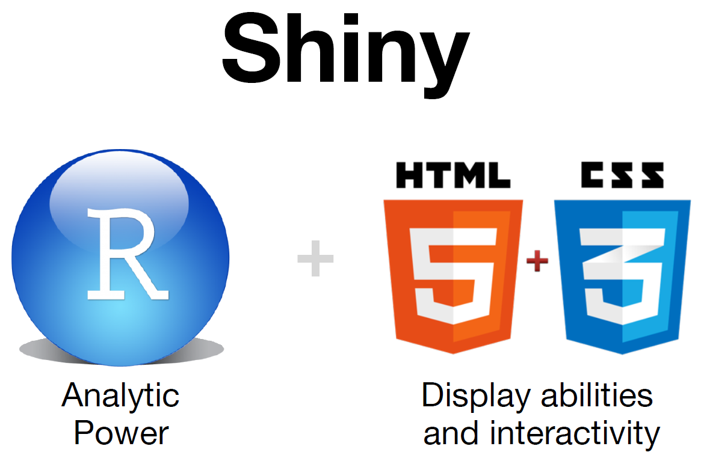

# Agenda


>- What is R?
>- Plotting
>- Interactive Plotting
>- Shiny
  - Examples
>- Resources


--- .segue .dark .nobackground

## R

<style>

 .title-slide {
     /*background-color: #FFFFFF*/
     background-image: url(assets/widgets/fpage.jpg);
     background-repeat: no-repeat;
     background-position: center center;
     background-size: 100% 100%;
   }
   
   iframe{background-color: white}

</style>


---

## Why R?

> - Open
> - Free
> - Access to powerful, cutting-edge analytics.
> - Great visualizations
> - Platform Independent (works on all OS)
> - Unrivaled help resources
> - A robust, vibrant community

--- .segue .dark .nobackground

## Plotting in R

---

## Read Data

```{r message = F, echo = T, cache = T}
# Read the data, including its header
dat <- read.csv("./assets/dataset/data.csv", header = T)
```


---

## R Classic Plot (1/4)

```{r message = F, echo = T, cache = T,  fig.width = 10, fig.height = 6, fig.align = 'center'}
# Plot dose on the x-axis, and Relative Risk (RR) on the y-axis
plot(dat$dose, dat$RR, main = "Dose Response Curve", xlab = "Dose", ylab = "Relative Risk")
```

---

## R Advanced Plot using GGPlot (2/4)

```{r warning= F, message = F, echo = T, cache = F,  fig.width=8, fig.height = 5, fig.align = 'center'}
# Load ggplot2 library
library(ggplot2)
# Plot ggplot
ggplot(dat, aes(dose, RR)) + geom_point() + xlab("Dose") + ylab("Relative Risk") + 
  ggtitle("Dose Response Curve")
```

--- 

## R Interactive Plot using Plotly (3/4)

```{r message = F, echo = T, cache = F,  fig.width=8, fig.height = 5, fig.align = 'center'}
# Load plotly
library(plotly)
# Create ggplot
gg <- ggplot(dat, aes(dose, RR)) + geom_point() + xlab("Dose") +  ylab("Relative Risk") + 
  ggtitle("Dose Response Curve")
# Convert ggplot into plotly
pgg <- ggplotly(gg)
# Not run
# pgg
```

---

## R Interactive Plot using Plotly (4/4)

<iframe src="./assets/widgets/plotly.html" width=100% height=400px allowtransparency="true"> </iframe>

---

## Example of World Development Indicators by World Bank

Fertility Rate

```{r setup, message = F, echo = F, cache = F}
require(rCharts)
require(RJSONIO)
knitr::opts_chunk$set(comment = NA, results = 'asis', tidy = F, message = T)
```

```{r chart2, echo=FALSE,message = F, cache = F} 
# require(knitr)
#require(googleVis)
#M1 <- gvisMotionChart(Fruits, idvar = 'Fruit', timevar = "Year")
#print(M1, tag = 'chart')

library(WDI)
library(rCharts)
library(plyr)

countries <- c("BE", "DE", "GR", "SE", "CH", "GB")

tfr <- WDI(country = countries, indicator = "SP.DYN.TFRT.IN", start = 1960, end = 2010)

#Clean up the data a bit
tfr <- rename(tfr, replace = c("SP.DYN.TFRT.IN" = "TFR"))

tfr$TFR <- round(tfr$TFR, 2)

# Create the chart
tfrPlot <- nPlot(
  TFR ~ year, 
  data = tfr, 
  group = "country",
  type = "lineChart")

# Add axis labels and format the tooltip
tfrPlot$yAxis(axisLabel = "Total fertility rate", width = 62)

tfrPlot$xAxis(axisLabel = "Year")

tfrPlot$chart(tooltipContent = "#! function(key, x, y){
        return '<h3>' + key + '</h3>' + 
        '<p>' + y + ' in ' + x + '</p>'
        } !#")

tfrPlot$print("chart2")
```


--- .segue .dark .nobackground

## Shiny

--- 

## What and Why?

>- Typical Web Application requires knowledge of:
  - HTML
  - Cascading Style Sheets (CSS)
  - Javascript
  
>- 

>- Shiny doesn't require any of them
>- An R package for web application
>- Few lines of code into a live application
>- Works in any R environment (Console of R, Rgui, Rstudio etc)
>- Attractive default UI theme based on [Bootstrap](http://getbootstrap.com/).
>- A host of input/output controls are provided

---

## Shiny App Example

```{r app, message = F, echo = T, cache = F}
library(shiny)
ui <- fluidPage(
  sidebarLayout(
    sidebarPanel(
      sliderInput("obs", "Number of observations:", min = 10, max = 500, value = 100)
    ),
    mainPanel(plotOutput("distPlot"))
  )
)

server <- function(input, output) {
  output$distPlot <- renderPlot({
    hist(rnorm(input$obs), col = 'darkgray', border = 'white')
  })
}
# Not Run
# shinyApp(ui = ui, server = server)
```

--- .segue .dark .nobackground

## Shiny Advanced Applications

---

## Propensity to Cycle Tool (PCT)

<iframe src="http://pct.bike/greater-manchester" allowtransparency="true"> </iframe>

---

## Impacts of Cycling Tool (ICT)


--- .segue .dark .nobackground

## Gallery

---

# Shiny Gallery

<iframe src="http://shiny.rstudio.com/gallery/" allowtransparency="true"> </iframe>

---

# RCharts Gallery

<iframe src="http://rcharts.io/gallery/" allowtransparency="true"> </iframe>

---

## Resources


---


---

## Hair Eye Color Dataset

```{r setup1, message = F, echo = F, cache = F}
require(rCharts)
require(RJSONIO)
knitr::opts_chunk$set(comment = NA, results = 'asis', tidy = F, message = T)
```


```{r chart1, echo=FALSE, cache = F}
hair_eye_male <- subset(as.data.frame(HairEyeColor), Sex == "Male")
n1 <- nPlot(Freq ~ Hair, group = "Eye", data = hair_eye_male, type = "multiBarChart")
n1$print("chart1")
```
