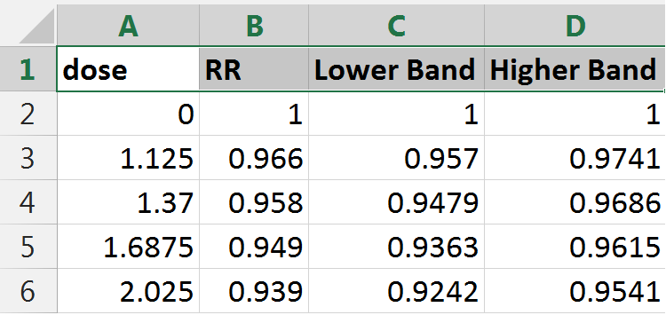
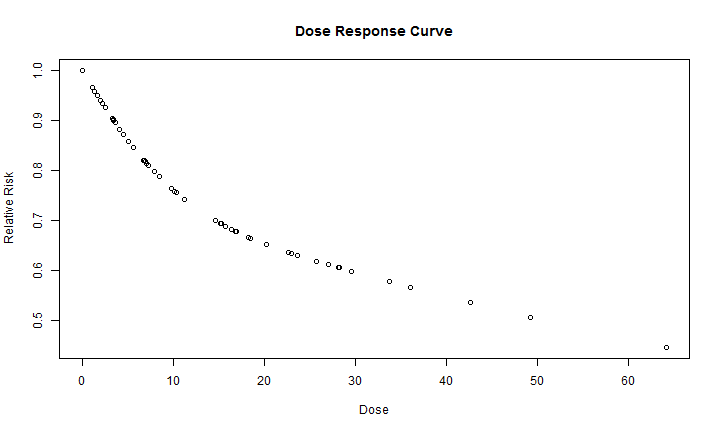
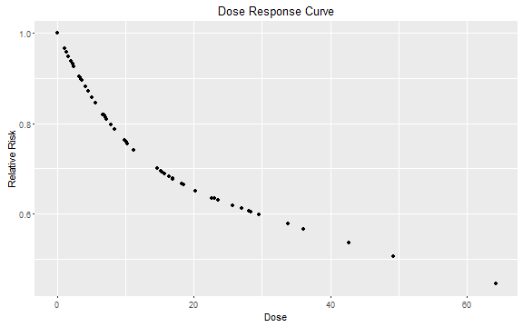
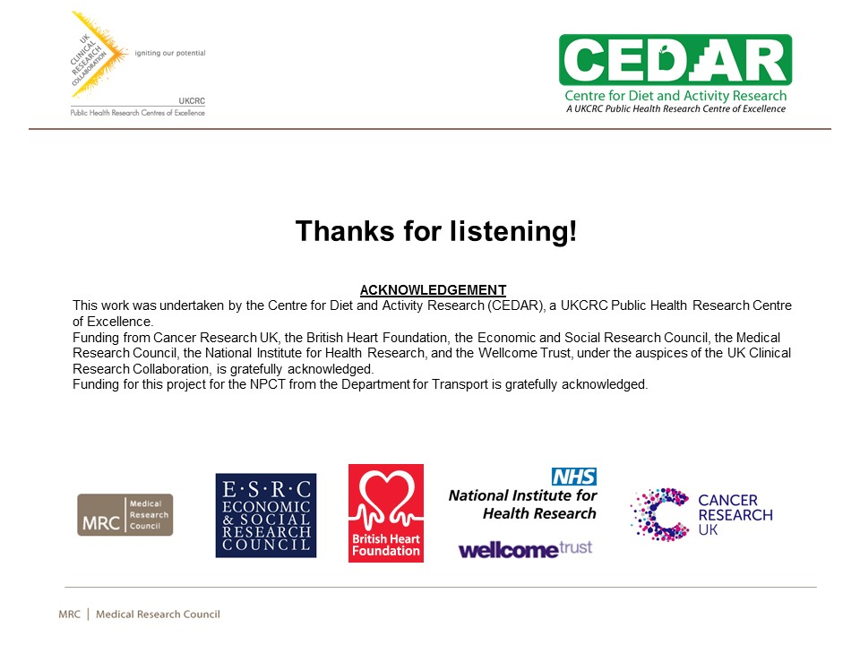

# Agenda


>- What is R?
>- Plotting
>- Interactive Plotting
>- Shiny
  - Examples
>- Resources


--- .segue .dark .nobackground

## R

<style>

 .title-slide {
     /*background-color: #FFFFFF*/
     background-image: url(assets/widgets/fpage.jpg);
     background-repeat: no-repeat;
     background-position: center center;
     background-size: 100% 100%;
   }
   
   iframe{background-color: white}

</style>


---

## Why R?

> - Open
> - Free
> - Access to powerful, cutting-edge analytics.
> - Great visualizations
> - Platform Independent (works on all OS)
> - Unrivaled help resources
> - A robust, vibrant community

--- .segue .dark .nobackground

## Plotting in R

---

## Read Data


```r
# Read the data, including its header
dat <- read.csv("./assets/dataset/data.csv", header = T)
```



---

## R Classic Plot (1/4)


```r
# Plot dose on the x-axis, and Relative Risk (RR) on the y-axis
plot(dat$dose, dat$RR, main = "Dose Response Curve", xlab = "Dose", ylab = "Relative Risk")
```



---

## R Advanced Plot using GGPlot (2/4)


```r
# Load ggplot2 library
library(ggplot2)
# Plot ggplot
ggplot(dat, aes(dose, RR)) + geom_point() + xlab("Dose") + ylab("Relative Risk") + 
  ggtitle("Dose Response Curve")
```



--- 

## R Interactive Plot using Plotly (3/4)


```r
# Load plotly
library(plotly)
# Create ggplot
gg <- ggplot(dat, aes(dose, RR)) + geom_point() + xlab("Dose") +  ylab("Relative Risk") + 
  ggtitle("Dose Response Curve")
# Convert ggplot into plotly
pgg <- ggplotly(gg)
# Not run
# pgg
```

---

## R Interactive Plot using Plotly (4/4)

<iframe src="./assets/widgets/plotly.html" width=100% height=400px allowtransparency="true"> </iframe>

---

## Example of World Development Indicators by World Bank

Fertility Rate


<div id = 'chart2' class = 'rChart nvd3'></div>
<script type='text/javascript'>
 $(document).ready(function(){
      drawchart2()
    });
    function drawchart2(){  
      var opts = {
 "dom": "chart2",
"width":    800,
"height":    400,
"x": "year",
"y": "TFR",
"group": "country",
"type": "lineChart",
"id": "chart2" 
},
        data = [
 {
 "iso2c": "BE",
"country": "Belgium",
"TFR":           1.86,
"year":           2010 
},
{
 "iso2c": "BE",
"country": "Belgium",
"TFR":           1.84,
"year":           2009 
},
{
 "iso2c": "BE",
"country": "Belgium",
"TFR":           1.85,
"year":           2008 
},
{
 "iso2c": "BE",
"country": "Belgium",
"TFR":           1.82,
"year":           2007 
},
{
 "iso2c": "BE",
"country": "Belgium",
"TFR":            1.8,
"year":           2006 
},
{
 "iso2c": "BE",
"country": "Belgium",
"TFR":           1.76,
"year":           2005 
},
{
 "iso2c": "BE",
"country": "Belgium",
"TFR":           1.72,
"year":           2004 
},
{
 "iso2c": "BE",
"country": "Belgium",
"TFR":           1.67,
"year":           2003 
},
{
 "iso2c": "BE",
"country": "Belgium",
"TFR":           1.65,
"year":           2002 
},
{
 "iso2c": "BE",
"country": "Belgium",
"TFR":           1.67,
"year":           2001 
},
{
 "iso2c": "BE",
"country": "Belgium",
"TFR":           1.67,
"year":           2000 
},
{
 "iso2c": "BE",
"country": "Belgium",
"TFR":           1.62,
"year":           1999 
},
{
 "iso2c": "BE",
"country": "Belgium",
"TFR":            1.6,
"year":           1998 
},
{
 "iso2c": "BE",
"country": "Belgium",
"TFR":            1.6,
"year":           1997 
},
{
 "iso2c": "BE",
"country": "Belgium",
"TFR":           1.59,
"year":           1996 
},
{
 "iso2c": "BE",
"country": "Belgium",
"TFR":           1.56,
"year":           1995 
},
{
 "iso2c": "BE",
"country": "Belgium",
"TFR":           1.56,
"year":           1994 
},
{
 "iso2c": "BE",
"country": "Belgium",
"TFR":           1.61,
"year":           1993 
},
{
 "iso2c": "BE",
"country": "Belgium",
"TFR":           1.65,
"year":           1992 
},
{
 "iso2c": "BE",
"country": "Belgium",
"TFR":           1.66,
"year":           1991 
},
{
 "iso2c": "BE",
"country": "Belgium",
"TFR":           1.62,
"year":           1990 
},
{
 "iso2c": "BE",
"country": "Belgium",
"TFR":           1.58,
"year":           1989 
},
{
 "iso2c": "BE",
"country": "Belgium",
"TFR":           1.57,
"year":           1988 
},
{
 "iso2c": "BE",
"country": "Belgium",
"TFR":           1.54,
"year":           1987 
},
{
 "iso2c": "BE",
"country": "Belgium",
"TFR":           1.54,
"year":           1986 
},
{
 "iso2c": "BE",
"country": "Belgium",
"TFR":           1.51,
"year":           1985 
},
{
 "iso2c": "BE",
"country": "Belgium",
"TFR":           1.54,
"year":           1984 
},
{
 "iso2c": "BE",
"country": "Belgium",
"TFR":           1.57,
"year":           1983 
},
{
 "iso2c": "BE",
"country": "Belgium",
"TFR":           1.61,
"year":           1982 
},
{
 "iso2c": "BE",
"country": "Belgium",
"TFR":           1.66,
"year":           1981 
},
{
 "iso2c": "BE",
"country": "Belgium",
"TFR":           1.68,
"year":           1980 
},
{
 "iso2c": "BE",
"country": "Belgium",
"TFR":           1.69,
"year":           1979 
},
{
 "iso2c": "BE",
"country": "Belgium",
"TFR":           1.69,
"year":           1978 
},
{
 "iso2c": "BE",
"country": "Belgium",
"TFR":           1.71,
"year":           1977 
},
{
 "iso2c": "BE",
"country": "Belgium",
"TFR":           1.73,
"year":           1976 
},
{
 "iso2c": "BE",
"country": "Belgium",
"TFR":           1.74,
"year":           1975 
},
{
 "iso2c": "BE",
"country": "Belgium",
"TFR":           1.83,
"year":           1974 
},
{
 "iso2c": "BE",
"country": "Belgium",
"TFR":           1.95,
"year":           1973 
},
{
 "iso2c": "BE",
"country": "Belgium",
"TFR":           2.09,
"year":           1972 
},
{
 "iso2c": "BE",
"country": "Belgium",
"TFR":           2.21,
"year":           1971 
},
{
 "iso2c": "BE",
"country": "Belgium",
"TFR":           2.25,
"year":           1970 
},
{
 "iso2c": "BE",
"country": "Belgium",
"TFR":           2.27,
"year":           1969 
},
{
 "iso2c": "BE",
"country": "Belgium",
"TFR":           2.31,
"year":           1968 
},
{
 "iso2c": "BE",
"country": "Belgium",
"TFR":           2.41,
"year":           1967 
},
{
 "iso2c": "BE",
"country": "Belgium",
"TFR":           2.52,
"year":           1966 
},
{
 "iso2c": "BE",
"country": "Belgium",
"TFR":           2.61,
"year":           1965 
},
{
 "iso2c": "BE",
"country": "Belgium",
"TFR":           2.71,
"year":           1964 
},
{
 "iso2c": "BE",
"country": "Belgium",
"TFR":           2.68,
"year":           1963 
},
{
 "iso2c": "BE",
"country": "Belgium",
"TFR":           2.59,
"year":           1962 
},
{
 "iso2c": "BE",
"country": "Belgium",
"TFR":           2.63,
"year":           1961 
},
{
 "iso2c": "BE",
"country": "Belgium",
"TFR":           2.54,
"year":           1960 
},
{
 "iso2c": "CH",
"country": "Switzerland",
"TFR":           1.52,
"year":           2010 
},
{
 "iso2c": "CH",
"country": "Switzerland",
"TFR":            1.5,
"year":           2009 
},
{
 "iso2c": "CH",
"country": "Switzerland",
"TFR":           1.48,
"year":           2008 
},
{
 "iso2c": "CH",
"country": "Switzerland",
"TFR":           1.46,
"year":           2007 
},
{
 "iso2c": "CH",
"country": "Switzerland",
"TFR":           1.44,
"year":           2006 
},
{
 "iso2c": "CH",
"country": "Switzerland",
"TFR":           1.42,
"year":           2005 
},
{
 "iso2c": "CH",
"country": "Switzerland",
"TFR":           1.42,
"year":           2004 
},
{
 "iso2c": "CH",
"country": "Switzerland",
"TFR":           1.39,
"year":           2003 
},
{
 "iso2c": "CH",
"country": "Switzerland",
"TFR":           1.39,
"year":           2002 
},
{
 "iso2c": "CH",
"country": "Switzerland",
"TFR":           1.38,
"year":           2001 
},
{
 "iso2c": "CH",
"country": "Switzerland",
"TFR":            1.5,
"year":           2000 
},
{
 "iso2c": "CH",
"country": "Switzerland",
"TFR":           1.48,
"year":           1999 
},
{
 "iso2c": "CH",
"country": "Switzerland",
"TFR":           1.47,
"year":           1998 
},
{
 "iso2c": "CH",
"country": "Switzerland",
"TFR":           1.48,
"year":           1997 
},
{
 "iso2c": "CH",
"country": "Switzerland",
"TFR":            1.5,
"year":           1996 
},
{
 "iso2c": "CH",
"country": "Switzerland",
"TFR":           1.48,
"year":           1995 
},
{
 "iso2c": "CH",
"country": "Switzerland",
"TFR":           1.49,
"year":           1994 
},
{
 "iso2c": "CH",
"country": "Switzerland",
"TFR":           1.51,
"year":           1993 
},
{
 "iso2c": "CH",
"country": "Switzerland",
"TFR":           1.58,
"year":           1992 
},
{
 "iso2c": "CH",
"country": "Switzerland",
"TFR":           1.58,
"year":           1991 
},
{
 "iso2c": "CH",
"country": "Switzerland",
"TFR":           1.58,
"year":           1990 
},
{
 "iso2c": "CH",
"country": "Switzerland",
"TFR":           1.56,
"year":           1989 
},
{
 "iso2c": "CH",
"country": "Switzerland",
"TFR":           1.57,
"year":           1988 
},
{
 "iso2c": "CH",
"country": "Switzerland",
"TFR":           1.52,
"year":           1987 
},
{
 "iso2c": "CH",
"country": "Switzerland",
"TFR":           1.53,
"year":           1986 
},
{
 "iso2c": "CH",
"country": "Switzerland",
"TFR":           1.52,
"year":           1985 
},
{
 "iso2c": "CH",
"country": "Switzerland",
"TFR":           1.53,
"year":           1984 
},
{
 "iso2c": "CH",
"country": "Switzerland",
"TFR":           1.52,
"year":           1983 
},
{
 "iso2c": "CH",
"country": "Switzerland",
"TFR":           1.56,
"year":           1982 
},
{
 "iso2c": "CH",
"country": "Switzerland",
"TFR":           1.55,
"year":           1981 
},
{
 "iso2c": "CH",
"country": "Switzerland",
"TFR":           1.55,
"year":           1980 
},
{
 "iso2c": "CH",
"country": "Switzerland",
"TFR":           1.52,
"year":           1979 
},
{
 "iso2c": "CH",
"country": "Switzerland",
"TFR":           1.51,
"year":           1978 
},
{
 "iso2c": "CH",
"country": "Switzerland",
"TFR":           1.53,
"year":           1977 
},
{
 "iso2c": "CH",
"country": "Switzerland",
"TFR":           1.55,
"year":           1976 
},
{
 "iso2c": "CH",
"country": "Switzerland",
"TFR":           1.61,
"year":           1975 
},
{
 "iso2c": "CH",
"country": "Switzerland",
"TFR":           1.73,
"year":           1974 
},
{
 "iso2c": "CH",
"country": "Switzerland",
"TFR":           1.81,
"year":           1973 
},
{
 "iso2c": "CH",
"country": "Switzerland",
"TFR":           1.91,
"year":           1972 
},
{
 "iso2c": "CH",
"country": "Switzerland",
"TFR":           2.04,
"year":           1971 
},
{
 "iso2c": "CH",
"country": "Switzerland",
"TFR":            2.1,
"year":           1970 
},
{
 "iso2c": "CH",
"country": "Switzerland",
"TFR":           2.19,
"year":           1969 
},
{
 "iso2c": "CH",
"country": "Switzerland",
"TFR":           2.29,
"year":           1968 
},
{
 "iso2c": "CH",
"country": "Switzerland",
"TFR":           2.39,
"year":           1967 
},
{
 "iso2c": "CH",
"country": "Switzerland",
"TFR":            2.5,
"year":           1966 
},
{
 "iso2c": "CH",
"country": "Switzerland",
"TFR":           2.59,
"year":           1965 
},
{
 "iso2c": "CH",
"country": "Switzerland",
"TFR":           2.66,
"year":           1964 
},
{
 "iso2c": "CH",
"country": "Switzerland",
"TFR":           2.65,
"year":           1963 
},
{
 "iso2c": "CH",
"country": "Switzerland",
"TFR":           2.58,
"year":           1962 
},
{
 "iso2c": "CH",
"country": "Switzerland",
"TFR":           2.52,
"year":           1961 
},
{
 "iso2c": "CH",
"country": "Switzerland",
"TFR":           2.44,
"year":           1960 
},
{
 "iso2c": "DE",
"country": "Germany",
"TFR":           1.39,
"year":           2010 
},
{
 "iso2c": "DE",
"country": "Germany",
"TFR":           1.36,
"year":           2009 
},
{
 "iso2c": "DE",
"country": "Germany",
"TFR":           1.38,
"year":           2008 
},
{
 "iso2c": "DE",
"country": "Germany",
"TFR":           1.37,
"year":           2007 
},
{
 "iso2c": "DE",
"country": "Germany",
"TFR":           1.33,
"year":           2006 
},
{
 "iso2c": "DE",
"country": "Germany",
"TFR":           1.34,
"year":           2005 
},
{
 "iso2c": "DE",
"country": "Germany",
"TFR":           1.36,
"year":           2004 
},
{
 "iso2c": "DE",
"country": "Germany",
"TFR":           1.34,
"year":           2003 
},
{
 "iso2c": "DE",
"country": "Germany",
"TFR":           1.34,
"year":           2002 
},
{
 "iso2c": "DE",
"country": "Germany",
"TFR":           1.35,
"year":           2001 
},
{
 "iso2c": "DE",
"country": "Germany",
"TFR":           1.38,
"year":           2000 
},
{
 "iso2c": "DE",
"country": "Germany",
"TFR":           1.36,
"year":           1999 
},
{
 "iso2c": "DE",
"country": "Germany",
"TFR":           1.36,
"year":           1998 
},
{
 "iso2c": "DE",
"country": "Germany",
"TFR":           1.35,
"year":           1997 
},
{
 "iso2c": "DE",
"country": "Germany",
"TFR":            1.3,
"year":           1996 
},
{
 "iso2c": "DE",
"country": "Germany",
"TFR":           1.25,
"year":           1995 
},
{
 "iso2c": "DE",
"country": "Germany",
"TFR":           1.24,
"year":           1994 
},
{
 "iso2c": "DE",
"country": "Germany",
"TFR":           1.28,
"year":           1993 
},
{
 "iso2c": "DE",
"country": "Germany",
"TFR":           1.29,
"year":           1992 
},
{
 "iso2c": "DE",
"country": "Germany",
"TFR":           1.33,
"year":           1991 
},
{
 "iso2c": "DE",
"country": "Germany",
"TFR":           1.45,
"year":           1990 
},
{
 "iso2c": "DE",
"country": "Germany",
"TFR":           1.42,
"year":           1989 
},
{
 "iso2c": "DE",
"country": "Germany",
"TFR":           1.46,
"year":           1988 
},
{
 "iso2c": "DE",
"country": "Germany",
"TFR":           1.43,
"year":           1987 
},
{
 "iso2c": "DE",
"country": "Germany",
"TFR":           1.43,
"year":           1986 
},
{
 "iso2c": "DE",
"country": "Germany",
"TFR":           1.37,
"year":           1985 
},
{
 "iso2c": "DE",
"country": "Germany",
"TFR":           1.29,
"year":           1984 
},
{
 "iso2c": "DE",
"country": "Germany",
"TFR":           1.33,
"year":           1983 
},
{
 "iso2c": "DE",
"country": "Germany",
"TFR":           1.41,
"year":           1982 
},
{
 "iso2c": "DE",
"country": "Germany",
"TFR":           1.43,
"year":           1981 
},
{
 "iso2c": "DE",
"country": "Germany",
"TFR":           1.44,
"year":           1980 
},
{
 "iso2c": "DE",
"country": "Germany",
"TFR":           1.38,
"year":           1979 
},
{
 "iso2c": "DE",
"country": "Germany",
"TFR":           1.38,
"year":           1978 
},
{
 "iso2c": "DE",
"country": "Germany",
"TFR":            1.4,
"year":           1977 
},
{
 "iso2c": "DE",
"country": "Germany",
"TFR":           1.45,
"year":           1976 
},
{
 "iso2c": "DE",
"country": "Germany",
"TFR":           1.45,
"year":           1975 
},
{
 "iso2c": "DE",
"country": "Germany",
"TFR":           1.51,
"year":           1974 
},
{
 "iso2c": "DE",
"country": "Germany",
"TFR":           1.54,
"year":           1973 
},
{
 "iso2c": "DE",
"country": "Germany",
"TFR":           1.71,
"year":           1972 
},
{
 "iso2c": "DE",
"country": "Germany",
"TFR":           1.92,
"year":           1971 
},
{
 "iso2c": "DE",
"country": "Germany",
"TFR":           2.03,
"year":           1970 
},
{
 "iso2c": "DE",
"country": "Germany",
"TFR":           2.21,
"year":           1969 
},
{
 "iso2c": "DE",
"country": "Germany",
"TFR":           2.38,
"year":           1968 
},
{
 "iso2c": "DE",
"country": "Germany",
"TFR":           2.48,
"year":           1967 
},
{
 "iso2c": "DE",
"country": "Germany",
"TFR":           2.53,
"year":           1966 
},
{
 "iso2c": "DE",
"country": "Germany",
"TFR":            2.5,
"year":           1965 
},
{
 "iso2c": "DE",
"country": "Germany",
"TFR":           2.54,
"year":           1964 
},
{
 "iso2c": "DE",
"country": "Germany",
"TFR":           2.51,
"year":           1963 
},
{
 "iso2c": "DE",
"country": "Germany",
"TFR":           2.44,
"year":           1962 
},
{
 "iso2c": "DE",
"country": "Germany",
"TFR":           2.45,
"year":           1961 
},
{
 "iso2c": "DE",
"country": "Germany",
"TFR":           2.37,
"year":           1960 
},
{
 "iso2c": "GB",
"country": "United Kingdom",
"TFR":           1.92,
"year":           2010 
},
{
 "iso2c": "GB",
"country": "United Kingdom",
"TFR":           1.89,
"year":           2009 
},
{
 "iso2c": "GB",
"country": "United Kingdom",
"TFR":           1.91,
"year":           2008 
},
{
 "iso2c": "GB",
"country": "United Kingdom",
"TFR":           1.86,
"year":           2007 
},
{
 "iso2c": "GB",
"country": "United Kingdom",
"TFR":           1.82,
"year":           2006 
},
{
 "iso2c": "GB",
"country": "United Kingdom",
"TFR":           1.76,
"year":           2005 
},
{
 "iso2c": "GB",
"country": "United Kingdom",
"TFR":           1.75,
"year":           2004 
},
{
 "iso2c": "GB",
"country": "United Kingdom",
"TFR":            1.7,
"year":           2003 
},
{
 "iso2c": "GB",
"country": "United Kingdom",
"TFR":           1.63,
"year":           2002 
},
{
 "iso2c": "GB",
"country": "United Kingdom",
"TFR":           1.63,
"year":           2001 
},
{
 "iso2c": "GB",
"country": "United Kingdom",
"TFR":           1.64,
"year":           2000 
},
{
 "iso2c": "GB",
"country": "United Kingdom",
"TFR":           1.68,
"year":           1999 
},
{
 "iso2c": "GB",
"country": "United Kingdom",
"TFR":           1.71,
"year":           1998 
},
{
 "iso2c": "GB",
"country": "United Kingdom",
"TFR":           1.72,
"year":           1997 
},
{
 "iso2c": "GB",
"country": "United Kingdom",
"TFR":           1.73,
"year":           1996 
},
{
 "iso2c": "GB",
"country": "United Kingdom",
"TFR":           1.71,
"year":           1995 
},
{
 "iso2c": "GB",
"country": "United Kingdom",
"TFR":           1.74,
"year":           1994 
},
{
 "iso2c": "GB",
"country": "United Kingdom",
"TFR":           1.76,
"year":           1993 
},
{
 "iso2c": "GB",
"country": "United Kingdom",
"TFR":           1.79,
"year":           1992 
},
{
 "iso2c": "GB",
"country": "United Kingdom",
"TFR":           1.82,
"year":           1991 
},
{
 "iso2c": "GB",
"country": "United Kingdom",
"TFR":           1.83,
"year":           1990 
},
{
 "iso2c": "GB",
"country": "United Kingdom",
"TFR":           1.79,
"year":           1989 
},
{
 "iso2c": "GB",
"country": "United Kingdom",
"TFR":           1.82,
"year":           1988 
},
{
 "iso2c": "GB",
"country": "United Kingdom",
"TFR":           1.81,
"year":           1987 
},
{
 "iso2c": "GB",
"country": "United Kingdom",
"TFR":           1.78,
"year":           1986 
},
{
 "iso2c": "GB",
"country": "United Kingdom",
"TFR":           1.79,
"year":           1985 
},
{
 "iso2c": "GB",
"country": "United Kingdom",
"TFR":           1.77,
"year":           1984 
},
{
 "iso2c": "GB",
"country": "United Kingdom",
"TFR":           1.77,
"year":           1983 
},
{
 "iso2c": "GB",
"country": "United Kingdom",
"TFR":           1.78,
"year":           1982 
},
{
 "iso2c": "GB",
"country": "United Kingdom",
"TFR":           1.82,
"year":           1981 
},
{
 "iso2c": "GB",
"country": "United Kingdom",
"TFR":            1.9,
"year":           1980 
},
{
 "iso2c": "GB",
"country": "United Kingdom",
"TFR":           1.86,
"year":           1979 
},
{
 "iso2c": "GB",
"country": "United Kingdom",
"TFR":           1.75,
"year":           1978 
},
{
 "iso2c": "GB",
"country": "United Kingdom",
"TFR":           1.69,
"year":           1977 
},
{
 "iso2c": "GB",
"country": "United Kingdom",
"TFR":           1.74,
"year":           1976 
},
{
 "iso2c": "GB",
"country": "United Kingdom",
"TFR":           1.81,
"year":           1975 
},
{
 "iso2c": "GB",
"country": "United Kingdom",
"TFR":           1.92,
"year":           1974 
},
{
 "iso2c": "GB",
"country": "United Kingdom",
"TFR":           2.04,
"year":           1973 
},
{
 "iso2c": "GB",
"country": "United Kingdom",
"TFR":            2.2,
"year":           1972 
},
{
 "iso2c": "GB",
"country": "United Kingdom",
"TFR":           2.41,
"year":           1971 
},
{
 "iso2c": "GB",
"country": "United Kingdom",
"TFR":           2.44,
"year":           1970 
},
{
 "iso2c": "GB",
"country": "United Kingdom",
"TFR":           2.51,
"year":           1969 
},
{
 "iso2c": "GB",
"country": "United Kingdom",
"TFR":            2.6,
"year":           1968 
},
{
 "iso2c": "GB",
"country": "United Kingdom",
"TFR":           2.68,
"year":           1967 
},
{
 "iso2c": "GB",
"country": "United Kingdom",
"TFR":           2.78,
"year":           1966 
},
{
 "iso2c": "GB",
"country": "United Kingdom",
"TFR":           2.86,
"year":           1965 
},
{
 "iso2c": "GB",
"country": "United Kingdom",
"TFR":           2.93,
"year":           1964 
},
{
 "iso2c": "GB",
"country": "United Kingdom",
"TFR":           2.88,
"year":           1963 
},
{
 "iso2c": "GB",
"country": "United Kingdom",
"TFR":           2.86,
"year":           1962 
},
{
 "iso2c": "GB",
"country": "United Kingdom",
"TFR":           2.78,
"year":           1961 
},
{
 "iso2c": "GB",
"country": "United Kingdom",
"TFR":           2.69,
"year":           1960 
},
{
 "iso2c": "GR",
"country": "Greece",
"TFR":           1.47,
"year":           2010 
},
{
 "iso2c": "GR",
"country": "Greece",
"TFR":           1.49,
"year":           2009 
},
{
 "iso2c": "GR",
"country": "Greece",
"TFR":           1.47,
"year":           2008 
},
{
 "iso2c": "GR",
"country": "Greece",
"TFR":           1.38,
"year":           2007 
},
{
 "iso2c": "GR",
"country": "Greece",
"TFR":           1.38,
"year":           2006 
},
{
 "iso2c": "GR",
"country": "Greece",
"TFR":           1.32,
"year":           2005 
},
{
 "iso2c": "GR",
"country": "Greece",
"TFR":            1.3,
"year":           2004 
},
{
 "iso2c": "GR",
"country": "Greece",
"TFR":           1.28,
"year":           2003 
},
{
 "iso2c": "GR",
"country": "Greece",
"TFR":           1.27,
"year":           2002 
},
{
 "iso2c": "GR",
"country": "Greece",
"TFR":           1.25,
"year":           2001 
},
{
 "iso2c": "GR",
"country": "Greece",
"TFR":           1.27,
"year":           2000 
},
{
 "iso2c": "GR",
"country": "Greece",
"TFR":           1.24,
"year":           1999 
},
{
 "iso2c": "GR",
"country": "Greece",
"TFR":           1.26,
"year":           1998 
},
{
 "iso2c": "GR",
"country": "Greece",
"TFR":           1.28,
"year":           1997 
},
{
 "iso2c": "GR",
"country": "Greece",
"TFR":           1.28,
"year":           1996 
},
{
 "iso2c": "GR",
"country": "Greece",
"TFR":           1.31,
"year":           1995 
},
{
 "iso2c": "GR",
"country": "Greece",
"TFR":           1.35,
"year":           1994 
},
{
 "iso2c": "GR",
"country": "Greece",
"TFR":           1.34,
"year":           1993 
},
{
 "iso2c": "GR",
"country": "Greece",
"TFR":           1.39,
"year":           1992 
},
{
 "iso2c": "GR",
"country": "Greece",
"TFR":           1.38,
"year":           1991 
},
{
 "iso2c": "GR",
"country": "Greece",
"TFR":            1.4,
"year":           1990 
},
{
 "iso2c": "GR",
"country": "Greece",
"TFR":            1.4,
"year":           1989 
},
{
 "iso2c": "GR",
"country": "Greece",
"TFR":            1.5,
"year":           1988 
},
{
 "iso2c": "GR",
"country": "Greece",
"TFR":            1.5,
"year":           1987 
},
{
 "iso2c": "GR",
"country": "Greece",
"TFR":            1.6,
"year":           1986 
},
{
 "iso2c": "GR",
"country": "Greece",
"TFR":           1.67,
"year":           1985 
},
{
 "iso2c": "GR",
"country": "Greece",
"TFR":           1.83,
"year":           1984 
},
{
 "iso2c": "GR",
"country": "Greece",
"TFR":           1.94,
"year":           1983 
},
{
 "iso2c": "GR",
"country": "Greece",
"TFR":           2.03,
"year":           1982 
},
{
 "iso2c": "GR",
"country": "Greece",
"TFR":           2.09,
"year":           1981 
},
{
 "iso2c": "GR",
"country": "Greece",
"TFR":           2.23,
"year":           1980 
},
{
 "iso2c": "GR",
"country": "Greece",
"TFR":           2.26,
"year":           1979 
},
{
 "iso2c": "GR",
"country": "Greece",
"TFR":           2.28,
"year":           1978 
},
{
 "iso2c": "GR",
"country": "Greece",
"TFR":           2.27,
"year":           1977 
},
{
 "iso2c": "GR",
"country": "Greece",
"TFR":           2.35,
"year":           1976 
},
{
 "iso2c": "GR",
"country": "Greece",
"TFR":           2.33,
"year":           1975 
},
{
 "iso2c": "GR",
"country": "Greece",
"TFR":           2.38,
"year":           1974 
},
{
 "iso2c": "GR",
"country": "Greece",
"TFR":           2.27,
"year":           1973 
},
{
 "iso2c": "GR",
"country": "Greece",
"TFR":           2.32,
"year":           1972 
},
{
 "iso2c": "GR",
"country": "Greece",
"TFR":           2.32,
"year":           1971 
},
{
 "iso2c": "GR",
"country": "Greece",
"TFR":            2.4,
"year":           1970 
},
{
 "iso2c": "GR",
"country": "Greece",
"TFR":           2.36,
"year":           1969 
},
{
 "iso2c": "GR",
"country": "Greece",
"TFR":           2.42,
"year":           1968 
},
{
 "iso2c": "GR",
"country": "Greece",
"TFR":           2.45,
"year":           1967 
},
{
 "iso2c": "GR",
"country": "Greece",
"TFR":           2.32,
"year":           1966 
},
{
 "iso2c": "GR",
"country": "Greece",
"TFR":           2.25,
"year":           1965 
},
{
 "iso2c": "GR",
"country": "Greece",
"TFR":           2.24,
"year":           1964 
},
{
 "iso2c": "GR",
"country": "Greece",
"TFR":           2.14,
"year":           1963 
},
{
 "iso2c": "GR",
"country": "Greece",
"TFR":           2.16,
"year":           1962 
},
{
 "iso2c": "GR",
"country": "Greece",
"TFR":           2.13,
"year":           1961 
},
{
 "iso2c": "GR",
"country": "Greece",
"TFR":           2.23,
"year":           1960 
},
{
 "iso2c": "SE",
"country": "Sweden",
"TFR":           1.98,
"year":           2010 
},
{
 "iso2c": "SE",
"country": "Sweden",
"TFR":           1.94,
"year":           2009 
},
{
 "iso2c": "SE",
"country": "Sweden",
"TFR":           1.91,
"year":           2008 
},
{
 "iso2c": "SE",
"country": "Sweden",
"TFR":           1.88,
"year":           2007 
},
{
 "iso2c": "SE",
"country": "Sweden",
"TFR":           1.85,
"year":           2006 
},
{
 "iso2c": "SE",
"country": "Sweden",
"TFR":           1.77,
"year":           2005 
},
{
 "iso2c": "SE",
"country": "Sweden",
"TFR":           1.75,
"year":           2004 
},
{
 "iso2c": "SE",
"country": "Sweden",
"TFR":           1.71,
"year":           2003 
},
{
 "iso2c": "SE",
"country": "Sweden",
"TFR":           1.65,
"year":           2002 
},
{
 "iso2c": "SE",
"country": "Sweden",
"TFR":           1.57,
"year":           2001 
},
{
 "iso2c": "SE",
"country": "Sweden",
"TFR":           1.54,
"year":           2000 
},
{
 "iso2c": "SE",
"country": "Sweden",
"TFR":            1.5,
"year":           1999 
},
{
 "iso2c": "SE",
"country": "Sweden",
"TFR":            1.5,
"year":           1998 
},
{
 "iso2c": "SE",
"country": "Sweden",
"TFR":           1.52,
"year":           1997 
},
{
 "iso2c": "SE",
"country": "Sweden",
"TFR":            1.6,
"year":           1996 
},
{
 "iso2c": "SE",
"country": "Sweden",
"TFR":           1.73,
"year":           1995 
},
{
 "iso2c": "SE",
"country": "Sweden",
"TFR":           1.88,
"year":           1994 
},
{
 "iso2c": "SE",
"country": "Sweden",
"TFR":           1.99,
"year":           1993 
},
{
 "iso2c": "SE",
"country": "Sweden",
"TFR":           2.09,
"year":           1992 
},
{
 "iso2c": "SE",
"country": "Sweden",
"TFR":           2.11,
"year":           1991 
},
{
 "iso2c": "SE",
"country": "Sweden",
"TFR":           2.13,
"year":           1990 
},
{
 "iso2c": "SE",
"country": "Sweden",
"TFR":           2.01,
"year":           1989 
},
{
 "iso2c": "SE",
"country": "Sweden",
"TFR":           1.96,
"year":           1988 
},
{
 "iso2c": "SE",
"country": "Sweden",
"TFR":           1.84,
"year":           1987 
},
{
 "iso2c": "SE",
"country": "Sweden",
"TFR":            1.8,
"year":           1986 
},
{
 "iso2c": "SE",
"country": "Sweden",
"TFR":           1.74,
"year":           1985 
},
{
 "iso2c": "SE",
"country": "Sweden",
"TFR":           1.66,
"year":           1984 
},
{
 "iso2c": "SE",
"country": "Sweden",
"TFR":           1.61,
"year":           1983 
},
{
 "iso2c": "SE",
"country": "Sweden",
"TFR":           1.62,
"year":           1982 
},
{
 "iso2c": "SE",
"country": "Sweden",
"TFR":           1.63,
"year":           1981 
},
{
 "iso2c": "SE",
"country": "Sweden",
"TFR":           1.68,
"year":           1980 
},
{
 "iso2c": "SE",
"country": "Sweden",
"TFR":           1.66,
"year":           1979 
},
{
 "iso2c": "SE",
"country": "Sweden",
"TFR":            1.6,
"year":           1978 
},
{
 "iso2c": "SE",
"country": "Sweden",
"TFR":           1.64,
"year":           1977 
},
{
 "iso2c": "SE",
"country": "Sweden",
"TFR":           1.68,
"year":           1976 
},
{
 "iso2c": "SE",
"country": "Sweden",
"TFR":           1.77,
"year":           1975 
},
{
 "iso2c": "SE",
"country": "Sweden",
"TFR":           1.87,
"year":           1974 
},
{
 "iso2c": "SE",
"country": "Sweden",
"TFR":           1.87,
"year":           1973 
},
{
 "iso2c": "SE",
"country": "Sweden",
"TFR":           1.91,
"year":           1972 
},
{
 "iso2c": "SE",
"country": "Sweden",
"TFR":           1.96,
"year":           1971 
},
{
 "iso2c": "SE",
"country": "Sweden",
"TFR":           1.92,
"year":           1970 
},
{
 "iso2c": "SE",
"country": "Sweden",
"TFR":           1.93,
"year":           1969 
},
{
 "iso2c": "SE",
"country": "Sweden",
"TFR":           2.07,
"year":           1968 
},
{
 "iso2c": "SE",
"country": "Sweden",
"TFR":           2.28,
"year":           1967 
},
{
 "iso2c": "SE",
"country": "Sweden",
"TFR":           2.37,
"year":           1966 
},
{
 "iso2c": "SE",
"country": "Sweden",
"TFR":           2.39,
"year":           1965 
},
{
 "iso2c": "SE",
"country": "Sweden",
"TFR":           2.47,
"year":           1964 
},
{
 "iso2c": "SE",
"country": "Sweden",
"TFR":           2.33,
"year":           1963 
},
{
 "iso2c": "SE",
"country": "Sweden",
"TFR":           2.25,
"year":           1962 
},
{
 "iso2c": "SE",
"country": "Sweden",
"TFR":           2.21,
"year":           1961 
},
{
 "iso2c": "SE",
"country": "Sweden",
"TFR":           2.17,
"year":           1960 
} 
]
  
      if(!(opts.type==="pieChart" || opts.type==="sparklinePlus" || opts.type==="bulletChart")) {
        var data = d3.nest()
          .key(function(d){
            //return opts.group === undefined ? 'main' : d[opts.group]
            //instead of main would think a better default is opts.x
            return opts.group === undefined ? opts.y : d[opts.group];
          })
          .entries(data);
      }
      
      if (opts.disabled != undefined){
        data.map(function(d, i){
          d.disabled = opts.disabled[i]
        })
      }
      
      nv.addGraph(function() {
        var chart = nv.models[opts.type]()
          .width(opts.width)
          .height(opts.height)
          
        if (opts.type != "bulletChart"){
          chart
            .x(function(d) { return d[opts.x] })
            .y(function(d) { return d[opts.y] })
        }
          
         
        chart
  .tooltipContent( function(key, x, y){
        return '<h3>' + key + '</h3>' + 
        '<p>' + y + ' in ' + x + '</p>'
        } )
          
        chart.xAxis
  .axisLabel("Year")

        
        
        chart.yAxis
  .axisLabel("Total fertility rate")
  .width(    62)
      
       d3.select("#" + opts.id)
        .append('svg')
        .datum(data)
        .transition().duration(500)
        .call(chart);

       nv.utils.windowResize(chart.update);
       return chart;
      });
    };
</script>


--- .segue .dark .nobackground

## Shiny

--- 

## What and Why?

>- Typical Web Application requires knowledge of:
  - HTML
  - Cascading Style Sheets (CSS)
  - Javascript
  
>- 

>- Shiny doesn't require any of them
>- An R package for web application
>- Few lines of code into a live application
>- Works in any R environment (Console of R, Rgui, Rstudio etc)
>- Attractive default UI theme based on [Bootstrap](http://getbootstrap.com/).
>- A host of input/output controls are provided

---

## Shiny App Example


```r
library(shiny)
ui <- fluidPage(
  sidebarLayout(
    sidebarPanel(
      sliderInput("obs", "Number of observations:", min = 10, max = 500, value = 100)
    ),
    mainPanel(plotOutput("distPlot"))
  )
)

server <- function(input, output) {
  output$distPlot <- renderPlot({
    hist(rnorm(input$obs), col = 'darkgray', border = 'white')
  })
}
# Not Run
# shinyApp(ui = ui, server = server)
```

--- .segue .dark .nobackground

## Shiny Advanced Applications

---

## Propensity to Cycle Tool (PCT)

<iframe src="http://pct.bike/greater-manchester" allowtransparency="true"> </iframe>

---

## Impacts of Cycling Tool (ICT)


--- .segue .dark .nobackground

## Gallery

---

# Shiny Gallery

<iframe src="http://shiny.rstudio.com/gallery/" allowtransparency="true"> </iframe>

---

# RCharts Gallery

<iframe src="http://rcharts.io/gallery/" allowtransparency="true"> </iframe>

---

## Resources


---



---

## Hair Eye Color Dataset


<div id = 'chart1' class = 'rChart nvd3'></div>
<script type='text/javascript'>
 $(document).ready(function(){
      drawchart1()
    });
    function drawchart1(){  
      var opts = {
 "dom": "chart1",
"width":    800,
"height":    400,
"x": "Hair",
"y": "Freq",
"group": "Eye",
"type": "multiBarChart",
"id": "chart1" 
},
        data = [
 {
 "Hair": "Black",
"Eye": "Brown",
"Sex": "Male",
"Freq":             32 
},
{
 "Hair": "Brown",
"Eye": "Brown",
"Sex": "Male",
"Freq":             53 
},
{
 "Hair": "Red",
"Eye": "Brown",
"Sex": "Male",
"Freq":             10 
},
{
 "Hair": "Blond",
"Eye": "Brown",
"Sex": "Male",
"Freq":              3 
},
{
 "Hair": "Black",
"Eye": "Blue",
"Sex": "Male",
"Freq":             11 
},
{
 "Hair": "Brown",
"Eye": "Blue",
"Sex": "Male",
"Freq":             50 
},
{
 "Hair": "Red",
"Eye": "Blue",
"Sex": "Male",
"Freq":             10 
},
{
 "Hair": "Blond",
"Eye": "Blue",
"Sex": "Male",
"Freq":             30 
},
{
 "Hair": "Black",
"Eye": "Hazel",
"Sex": "Male",
"Freq":             10 
},
{
 "Hair": "Brown",
"Eye": "Hazel",
"Sex": "Male",
"Freq":             25 
},
{
 "Hair": "Red",
"Eye": "Hazel",
"Sex": "Male",
"Freq":              7 
},
{
 "Hair": "Blond",
"Eye": "Hazel",
"Sex": "Male",
"Freq":              5 
},
{
 "Hair": "Black",
"Eye": "Green",
"Sex": "Male",
"Freq":              3 
},
{
 "Hair": "Brown",
"Eye": "Green",
"Sex": "Male",
"Freq":             15 
},
{
 "Hair": "Red",
"Eye": "Green",
"Sex": "Male",
"Freq":              7 
},
{
 "Hair": "Blond",
"Eye": "Green",
"Sex": "Male",
"Freq":              8 
} 
]
  
      if(!(opts.type==="pieChart" || opts.type==="sparklinePlus" || opts.type==="bulletChart")) {
        var data = d3.nest()
          .key(function(d){
            //return opts.group === undefined ? 'main' : d[opts.group]
            //instead of main would think a better default is opts.x
            return opts.group === undefined ? opts.y : d[opts.group];
          })
          .entries(data);
      }
      
      if (opts.disabled != undefined){
        data.map(function(d, i){
          d.disabled = opts.disabled[i]
        })
      }
      
      nv.addGraph(function() {
        var chart = nv.models[opts.type]()
          .width(opts.width)
          .height(opts.height)
          
        if (opts.type != "bulletChart"){
          chart
            .x(function(d) { return d[opts.x] })
            .y(function(d) { return d[opts.y] })
        }
          
         
        
          
        

        
        
        
      
       d3.select("#" + opts.id)
        .append('svg')
        .datum(data)
        .transition().duration(500)
        .call(chart);

       nv.utils.windowResize(chart.update);
       return chart;
      });
    };
</script>
